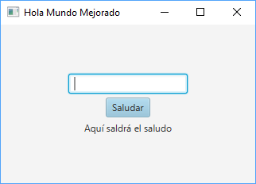
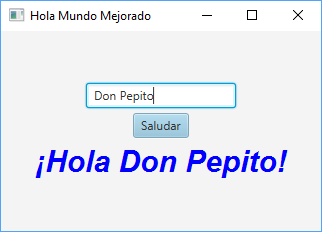

# HolaJavaFX

Versión del proyecto [HolaGUI](https://github.com/dam-dad/HolaGUI) mejorando algunos aspectos en cuanto a la implementación y aplicando buenas prácticas.





## Ejecución

1. Descargar el código fuente y entrar en el directorio proyecto:

```bash
git clone https://github.com/dam-dad/HolaJavaFX.git
cd HolaJavaFX
```

2. Construir el proyecto y crear un JAR ejecutable en el directorio `target`:

```bash
mvn package
```

3. Ejecutar la aplicación:

```bash
mvn exec:java
```
